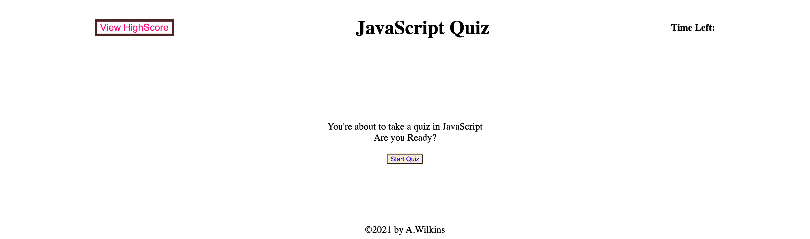

# Javascript-Quiz

## Description

A JavaScript quiz to highlight learned skills in html manipulation using the DOM.

## Table of Contents

- [Links](#links)
- [Usages](#usages)
- [Acceptance Criteria](#acceptance-criteria)
- [Contribution](#contribution)

## Links

- [GitHub Repo](https://github.com/a-breezy/Javascript-Quiz)
- [Live URL](https://a-breezy.github.io/Javascript-Quiz/)

## Usages

## Acceptance Criteria

GIVEN I am taking a code quiz
WHEN I click the start button
THEN a timer starts and I am presented with a question
WHEN I answer a question
THEN I am presented with another question
WHEN I answer a question incorrectly
THEN time is subtracted from the clock
WHEN all questions are answered or the timer reaches 0
THEN the game is over
WHEN the game is over
THEN I can save my initials and score

## Contribution

Made with ❤️ by a-breezy
Logical help from @andrewyu22 and @jonathan-Gomez
